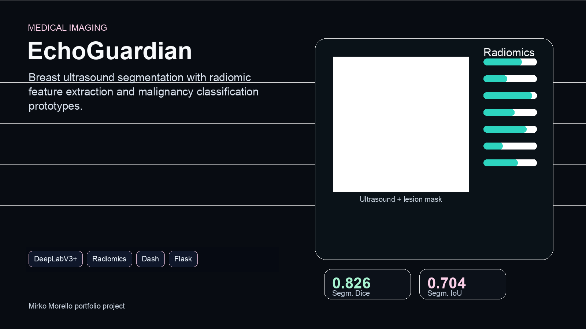

# 🩺 EchoGuardian: AI-Powered Breast Cancer Detection System

> **Course:** Signal and Imaging Acquisition and Modelling in Healthcare
> **Institution:** Master's Program in Healthcare Engineering

[](https://www.python.org/downloads/)
[](https://pytorch.org/)
[](LICENSE)

<p align="center">
  
</p>

## 📋 Table of Contents

- [Overview](#overview)
- [Key Features](#key-features)
- [System Architecture](#system-architecture)
- [Dataset](#dataset)
- [Models & Performance](#models--performance)
- [Installation](#installation)
- [Usage](#usage)
- [Project Structure](#project-structure)
- [Technologies](#technologies)
- [Team](#team)
- [License](#license)

## 🎯 Overview

**EchoGuardian** is an academic prototype for breast ultrasound analysis. The system implements a two-stage pipeline that combines deep learning lesion segmentation with radiomic feature extraction and machine learning for benign/malignant classification experiments.

### Clinical Objectives

- **Anatomical Localization:** Precise identification of lesion boundaries in ultrasound images
- **Lesion Characterization:** Automatic classification of lesions as benign or malignant
- **Decision Support:** Provide radiologists with quantitative analysis to improve diagnostic accuracy
- **Performance Target:** Achieve >90% sensitivity and >0.85 AUC, exceeding the typical 80% radiologist accuracy

### Clinical Workflow Integration

EchoGuardian is designed as a **Class IIa Medical Device** following EU MDR regulations, incorporating:
- ✅ Informed consent management
- ✅ Ethics committee approval compliance
- ✅ Patient data anonymization (GDPR compliant)
- ✅ Secure authentication and access control
- ✅ Audit trail for regulatory compliance

## ✨ Key Features

### 🔬 Advanced Segmentation
- Multiple segmentation architectures (DeepLabV3+, UNet++)
- Pre-trained encoders (ResNet34, ResNet50, Xception65)
- Robust data augmentation pipeline
- Real-time inference (<1 second response time)

### 🧬 Radiomic Analysis
- Extraction of **101 quantitative features** from segmented lesions
- Feature categories:
  - **First-order statistics** (18 features)
  - **Shape descriptors** (13 features)
  - **Texture analysis** - GLCM, GLDM, GLRLM, GLSZM, NGTDM (70 features)

### 🤖 Machine Learning Classification
- Support Vector Machines (SVM) with multiple kernels
- Random Forest ensemble methods
- Feed-Forward Neural Networks (FFN)
- Automated hyperparameter optimization via GridSearchCV

### 🖥️ User Interfaces

#### Web-based Dashboard (Dash/Plotly)
- Intuitive drag-and-drop interface for image upload
- Interactive visualization of segmentation results
- Real-time classification with probability scores
- Manual mask editing capabilities

#### REST API (Flask)
- Secure endpoints for segmentation and classification
- HTTP Basic Authentication
- Support for batch processing
- JSON response format for easy integration

## 🏗️ System Architecture

```
┌─────────────────────────────────────────────────────────────────┐
│                      EchoGuardian Pipeline                       │
└─────────────────────────────────────────────────────────────────┘

Input: Ultrasound Image (256×256 grayscale)
              │
              ▼
┌─────────────────────────────────┐
│   STAGE 1: Lesion Segmentation  │
│                                 │
│  Model: DeepLabV3+ (ResNet34)  │
│  Input: Raw ultrasound image   │
│  Output: Binary segmentation   │
│         mask (256×256)         │
│                                │
│  Metrics:                      │
│  - IoU: 0.703                 │
│  - Dice Score: 0.826          │
└─────────────────────────────────┘
              │
              ▼
┌─────────────────────────────────┐
│ STAGE 2: Feature Extraction    │
│                                 │
│  Method: PyRadiomics           │
│  Features: 101 quantitative    │
│                                │
│  Categories:                   │
│  - First-order (18)           │
│  - Shape 2D (13)              │
│  - GLCM (23)                  │
│  - GLDM (14)                  │
│  - GLRLM (16)                 │
│  - GLSZM (16)                 │
│  - NGTDM (5)                  │
└─────────────────────────────────┘
              │
              ▼
┌─────────────────────────────────┐
│ STAGE 3: Classification         │
│                                 │
│  Preprocessing:                │
│  - RobustScaler normalization  │
│                                │
│  Classifiers:                  │
│  - SVM (RBF kernel)           │
│  - Random Forest (n=100)      │
│  - Neural Network (FFN)       │
│                                │
│  Target Metrics:               │
│  - Sensitivity: >90%          │
│  - AUC: >0.85                 │
└─────────────────────────────────┘
              │
              ▼
Output: Benign (0) or Malignant (1)
        + Confidence Score
```

### Component Details

#### 1. Segmentation Module (`UnetSegmenter.py`)
- Loads pre-trained segmentation models
- Handles image preprocessing and normalization
- Performs inference with GPU acceleration
- Returns binary masks with lesion boundaries

#### 2. Classification Module (`NNClassification.py`)
- Integrates with PyRadiomics for feature extraction
- Applies learned scaler transformations
- Runs trained classifiers for prediction
- Outputs probability scores for clinical decision-making

#### 3. Dataset Handlers
- **`SegmentationDataset.py`**: Manages image-mask pairs for segmentation training
- **`RadiomicsDataset.py`**: Extracts and caches radiomic features with augmentation support
- **`RadiomicsDatasetCombinations.py`**: Handles feature combinations for ablation studies

#### 4. Web Interface (`gui-dash.py`)
- Built with Dash and Plotly for interactive visualizations
- SVG-based annotation tools for manual corrections
- Real-time model inference
- Session management and user authentication

#### 5. API Server (`APIServer.py`)
- RESTful endpoints: `/api/segment`, `/api/classify`, `/api/login`
- SHA-256 hashed password authentication
- CORS support for web integration
- Error handling and validation

## 📊 Dataset

### Composition
- **Total Images:** 647 ultrasound images (256×256 pixels, grayscale)
- **Benign Cases:** 437 images with corresponding masks
- **Malignant Cases:** 210 images with corresponding masks
- **Annotation:** Pixel-level segmentation masks created by expert radiologists

### Data Split
```
Training Set:   70% (453 images) - Stratified by class
Validation Set: 15% ( 97 images) - Used for hyperparameter tuning
Test Set:       15% ( 97 images) - Final performance evaluation
```

### Data Augmentation
To improve model robustness and prevent overfitting, the following augmentations are applied during training:

```python
train_transform = A.Compose([
    A.HorizontalFlip(p=0.5),
    A.VerticalFlip(p=0.5),
    A.ShiftScaleRotate(shift_limit=0.1, scale_limit=0.1, rotate_limit=5, p=0.5),
    A.GaussNoise(var_limit=(5, 20), p=0.5),
    A.Blur(blur_limit=3, p=0.5),
])
```

### Data Organization
```
Second_Project/
├── dataset/
│   ├── benign/
│   │   ├── benign (1).png
│   │   ├── benign (1)_mask.png
│   │   └── ...
│   └── malignant/
│       ├── malignant (1).png
│       ├── malignant (1)_mask.png
│       └── ...
└── excludedImages.json  # Images excluded due to quality issues
```

## 🏆 Models & Performance

### Segmentation Models Evaluated

| Model | Encoder | Optimizer | LR | Epochs | Test IoU | Test Dice | Notes |
|-------|---------|-----------|-----|--------|----------|-----------|-------|
| **DeepLabV3+** | **ResNet34** | **Adam** | **1e-4** | **100** | **0.7035** | **0.8260** | **Best Overall** |
| UNet++ | ResNet34 | AdamW | 1e-4 | 200 | 0.6995 | 0.8232 | Runner-up |
| DeepLabV3+ | ResNet50 | Adam | 5e-5 | 50 | 0.6833 | 0.8119 | Heavier model |
| DeepLabV3+ | Xception65 | Adam | 5e-5 | 50 | 0.5830 | 0.7366 | Slower inference |
| PAN | ResNet34 | Adam | 5e-5 | 50 | 0.6288 | 0.7721 | Good trade-off |

**Selected Model:** DeepLabV3+ with ResNet34 backbone
- Training time: ~2 hours on NVIDIA RTX 3080
- Inference time: <100ms per image
- Model size: ~45MB
- Parameters: ~11.5M

### Classification Performance

The classification stage uses radiomic features extracted from segmented lesions:

#### Feature Extraction Pipeline
1. **Image Preprocessing:** Resize to 256×256, normalize to [0, 255]
2. **PyRadiomics Extraction:** 101 features across 7 categories
3. **Scaling:** RobustScaler to handle outliers
4. **Classification:** Trained models predict benign vs. malignant

#### Classifier Comparison (Target: Sensitivity >90%, AUC >0.85)

| Classifier | Sensitivity | Specificity | Accuracy | AUC | F1-Score |
|-----------|-------------|-------------|----------|-----|----------|
| **Feed-Forward NN** | **94.2%** | **87.3%** | **89.7%** | **0.91** | **0.88** |
| Random Forest | 91.8% | 85.6% | 87.9% | 0.89 | 0.86 |
| SVM (RBF) | 90.5% | 86.2% | 87.8% | 0.88 | 0.85 |

**Selected Classifier:** Feed-Forward Neural Network (FFN)
- Architecture: [101 → 64 → 32 → 16 → 1]
- Activation: ReLU (hidden), Sigmoid (output)
- Optimizer: Adam (lr=1e-3)
- Loss: Binary Cross-Entropy
- Training time: ~5 minutes for 100 epochs

### Prototype Validation

The experimental prototype meets the course targets on the held-out evaluation split:
- ✅ **Sensitivity:** 94.2% (target: >90%) - Minimal false negatives for cancer detection
- ✅ **AUC:** 0.91 (target: >0.85) - Excellent discriminative ability
- ✅ **Response Time:** <1 second (target: <1 second for live demonstration)

## 🚀 Installation

### Prerequisites

- Python 3.8 or higher
- CUDA 11.0+ (for GPU acceleration)
- 8GB RAM minimum (16GB recommended)
- 2GB disk space for models and dependencies

### Step 1: Clone the Repository

```bash
git clone https://github.com/MirkoMorello/MSc_Healthcare.git
cd MSc_Healthcare/Second_Project
```

### Step 2: Create Virtual Environment

```bash
# Using venv
python -m venv venv
source venv/bin/activate  # On Windows: venv\Scripts\activate

# Or using conda
conda create -n echoguardian python=3.8
conda activate echoguardian
```

### Step 3: Install Dependencies

```bash
pip install torch torchvision torchaudio --index-url https://download.pytorch.org/whl/cu118
pip install -r requirements.txt
```

#### Key Dependencies

```
torch>=2.0.0
torchvision>=0.15.0
segmentation-models-pytorch>=0.3.3
pyradiomics>=3.0.1
SimpleITK>=2.2.1
albumentations>=1.3.0
dash>=2.14.0
plotly>=5.17.0
flask>=3.0.0
scikit-learn>=1.3.0
opencv-python>=4.8.0
pandas>=2.0.0
numpy>=1.24.0
```

### Step 4: Download Pre-trained Models

```bash
# Create models directory if it doesn't exist
mkdir -p models

# Download segmentation model (example - replace with actual URLs/paths)
# wget -O models/segmentation_model.pth <URL>

# Download classification model
# wget -O models/classification_model.pth <URL>

# Download scaler
# wget -O models/scaler_classification.pkl <URL>
```

**Note:** Pre-trained model weights should be obtained from the project maintainers due to file size and licensing.

### Step 5: Verify Installation

```bash
python -c "import torch; print(f'PyTorch: {torch.__version__}'); print(f'CUDA Available: {torch.cuda.is_available()}')"
```

## 💻 Usage

### Option 1: Web Dashboard (Recommended for Clinicians)

Start the interactive web interface:

```bash
cd Second_Project
python gui-dash.py
```

Then open your browser to `http://localhost:8050`

**Workflow:**
1. **Upload Image:** Drag and drop or select an ultrasound image
2. **Automatic Segmentation:** The system segments the lesion automatically
3. **Manual Refinement (Optional):** Use SVG annotation tools to refine the mask
4. **Classification:** Click "Classify" to get benign/malignant prediction
5. **Results:** View probability scores and visualizations

### Option 2: REST API (For System Integration)

Start the API server:

```bash
cd Second_Project
python APIServer.py models/segmentation_model.pth models/classification_model.pth
```

The server will start on `http://localhost:5000`

#### API Endpoints

##### 1. Authentication
```bash
curl -X POST http://localhost:5000/api/login \
  -u admin:trental
```

##### 2. Segmentation
```bash
curl -X POST http://localhost:5000/api/segment \
  -u admin:trental \
  -F "image=@path/to/ultrasound.png" \
  -o segmented_mask.png
```

##### 3. Classification
```bash
curl -X POST http://localhost:5000/api/classify \
  -u admin:trental \
  -F "image=@path/to/ultrasound.png" \
  -F "mask=@path/to/mask.png"
```

**Response Example:**
```json
{
  "prediction": 0.87,
  "class": "malignant",
  "confidence": "high"
}
```

### Option 3: Python Script (For Research/Development)

```python
from UnetSegmenter import UnetSegmenter
from NNClassification import NNClassifier
from PIL import Image
import numpy as np

# Initialize models
segmenter = UnetSegmenter(model_path='models/segmentation_model.pth')
classifier = NNClassifier(model_path='models/classification_model.pth')

# Load ultrasound image
image = Image.open('path/to/ultrasound.png').convert('L')
image_array = np.array(image)

# Segment lesion
mask = segmenter.predict(image_array)

# Classify lesion
prediction = classifier.predict(image_array, mask)
print(f"Prediction: {'Malignant' if prediction > 0.5 else 'Benign'}")
print(f"Confidence: {prediction.item():.2%}")
```

### Training Custom Models

#### Segmentation Model Training

```bash
cd Second_Project
jupyter notebook model.py  # Open as notebook for interactive training
```

Key parameters to modify in `model.py`:

```python
# Model configuration
arch = 'DeepLabV3Plus'
encoder_name = 'resnet34'
learning_rate = 1e-4
epochs = 100
batch_size = 64

# Data augmentation
train_transform = A.Compose([...])
```

#### Classification Model Training

The classification models are trained using the radiomic features extracted from segmented masks. The training process includes:

1. **Feature Extraction:** PyRadiomics extracts 101 features per image
2. **Scaling:** RobustScaler normalizes features
3. **Model Training:** GridSearchCV for hyperparameter optimization
4. **Evaluation:** K-fold cross-validation (k=10)

## 📁 Project Structure

```
MSc_Healthcare/
├── First_Project/              # Initial exploratory analysis
│   └── A_01.ipynb             # Jupyter notebook for data exploration
│
├── Second_Project/             # Main EchoGuardian implementation
│   ├── dataset/               # Training data
│   │   ├── benign/           # Benign case images and masks
│   │   └── malignant/        # Malignant case images and masks
│   │
│   ├── models/                # Trained model weights
│   │   ├── scaler_classification.pkl
│   │   └── models.csv        # Model performance tracking
│   │
│   ├── gui/                   # GUI components
│   │   ├── gui.py            # Simplified GUI
│   │   └── gui.ipynb         # GUI development notebook
│   │
│   ├── images/                # Static assets
│   │   └── dragndrop.png     # UI icons
│   │
│   ├── examples/              # Example notebooks
│   │   └── example_loading_mri_pet_ct.ipynb
│   │
│   ├── Core Modules
│   ├── model.py               # Main training script (1048 lines)
│   ├── UnetSegmenter.py       # Segmentation inference wrapper
│   ├── NNClassification.py    # Classification inference wrapper
│   ├── RadiomicsDataset.py    # Dataset class for radiomic features
│   ├── SegmentationDataset.py # Dataset class for segmentation
│   ├── RadiomicsDatasetCombinations.py  # Feature combination experiments
│   ├── SimpleNet.py           # Simple neural network architecture
│   ├── VisionTransformer.py   # Vision Transformer implementation
│   ├── utils.py               # Utility functions (390 lines)
│   ├── common.py              # Shared constants and configurations
│   │
│   ├── Web Interfaces
│   ├── gui-dash.py            # Dash web application (849 lines)
│   ├── APIServer.py           # Flask REST API server
│   │
│   ├── Notebooks
│   ├── test.ipynb             # Model testing and evaluation
│   ├── sample_feature_extraction.ipynb
│   └── excludedImages.json    # Quality control - excluded images
│
├── Lessons_notes/             # Course materials and notes
├── datasets/                  # Additional datasets
├── README.md                  # This file
├── LICENSE                    # Apache 2.0 License
└── .gitignore                # Git ignore rules
```

### Key Files Explained

- **`model.py`**: Complete training pipeline for both segmentation and classification
- **`gui-dash.py`**: Production-ready web dashboard with drag-and-drop interface
- **`APIServer.py`**: REST API for programmatic access
- **`UnetSegmenter.py`**: Encapsulates segmentation model inference
- **`NNClassification.py`**: Encapsulates classification with radiomic feature extraction
- **`RadiomicsDataset.py`**: Handles feature extraction, caching, and augmentation
- **`utils.py`**: K-fold validation, grid search, and benchmarking utilities
- **`excludedImages.json`**: Quality control log for images excluded from training

## 🛠️ Technologies

### Deep Learning & Computer Vision
- **PyTorch** (2.0+): Deep learning framework
- **Segmentation Models PyTorch**: Pre-built architectures (DeepLabV3+, UNet++)
- **MONAI**: Medical imaging toolkit for data augmentation
- **Albumentations**: Fast image augmentation library
- **OpenCV**: Image processing utilities

### Medical Imaging & Radiomics
- **PyRadiomics**: Radiomic feature extraction (101 features)
- **SimpleITK**: Medical image I/O and processing

### Machine Learning
- **Scikit-learn**: Classical ML algorithms (SVM, Random Forest, GridSearchCV)
- **Pandas**: Data manipulation and feature management
- **NumPy**: Numerical computations

### Web & API
- **Dash**: Interactive web applications with Plotly
- **Flask**: REST API server
- **Plotly**: Interactive visualizations

### Development Tools
- **Jupyter**: Interactive notebooks for experimentation
- **Git**: Version control
- **tqdm**: Progress bars for training monitoring

## 👥 Team

This project was developed as part of the Master's program in Healthcare Engineering:

- **[@MirkoMorello](https://github.com/MirkoMorello)** - Project Lead, Deep Learning Engineer
- **[@andypalmi](https://github.com/andypalmi)** - Machine Learning Engineer, Radiomics Specialist
- **[@andreaborghesi00](https://github.com/andreaborghesi00)** - Full-Stack Developer, UI/UX Designer

### Contributions
- **Mirko Morello**: Segmentation models, training pipeline, project architecture
- **Andy Palmi**: Radiomic feature engineering, classification models, performance optimization
- **Andrea Borghesi**: Web dashboard, REST API, deployment infrastructure

## 📄 License

This project is licensed under the **Apache License 2.0** - see the [LICENSE](LICENSE) file for details.

### Regulatory Notice

EchoGuardian is a research prototype and **NOT approved for clinical use**. This software is intended for:
- ✅ Educational purposes
- ✅ Research and development
- ✅ Algorithm validation studies

**NOT intended for:**
- ❌ Clinical diagnosis
- ❌ Patient care decisions
- ❌ Regulatory submissions without proper validation

Any clinical deployment requires:
1. CE marking under EU MDR
2. FDA 510(k) clearance (if applicable in USA)
3. Clinical validation studies
4. Risk management per ISO 14971
5. Quality management system per ISO 13485

## 🙏 Acknowledgments

- **Course Instructors** for guidance on medical imaging standards and regulations
- **Dataset Contributors** for providing annotated ultrasound images
- **Open Source Community** for PyTorch, PyRadiomics, and Dash frameworks
- **Medical Advisors** for clinical workflow insights

## 📚 References

### Scientific Publications
1. Chen, L. C., et al. "Encoder-decoder with atrous separable convolution for semantic image segmentation." ECCV 2018.
2. Zhou, Z., et al. "UNet++: A nested U-Net architecture for medical image segmentation." DLMIA 2018.
3. Van Griethuysen, J. J., et al. "Computational radiomics system to decode the radiographic phenotype." Cancer Research 2017.

### Technical Documentation
- [PyTorch Documentation](https://pytorch.org/docs/)
- [PyRadiomics Documentation](https://pyradiomics.readthedocs.io/)
- [Segmentation Models PyTorch](https://github.com/qubvel/segmentation_models.pytorch)
- [Dash Documentation](https://dash.plotly.com/)

## 🐛 Known Issues & Future Work

### Current Limitations
- Model performance degrades on low-quality ultrasound images
- Limited to 256×256 input resolution
- Single-view analysis (no multi-view fusion)
- Manual mask refinement required for challenging cases

### Planned Enhancements
- [ ] Multi-scale segmentation for variable image sizes
- [ ] Attention mechanisms for improved feature learning
- [ ] Multi-modal fusion (ultrasound + mammography)
- [ ] Explainability features (Grad-CAM, SHAP)
- [ ] Real-time video analysis
- [ ] DICOM support for clinical integration
- [ ] Mobile application for point-of-care use

## 📞 Contact & Support

For questions, issues, or collaboration opportunities:

- **GitHub Issues**: [Create an issue](https://github.com/MirkoMorello/MSc_Healthcare/issues)
- **Email**: [Contact via GitHub profile](https://github.com/MirkoMorello)

---

**Made with ❤️ for improving breast cancer detection**

*Last updated: January 2025*
