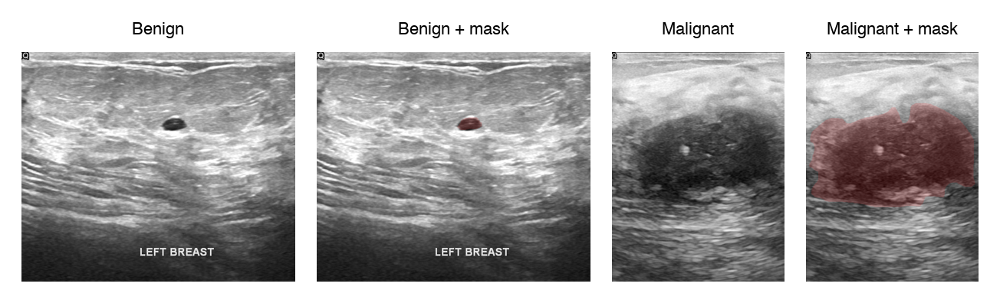

# Breast Ultrasound: Lesion Segmentation and Classification


Coursework for a healthcare signal- and image-processing course, built
around the BUSI breast-ultrasound dataset. The main project is a two-stage
pipeline: a U-Net segments the lesion from the ultrasound image, radiomic
features (GLCM texture, shape, first-order statistics via PyRadiomics) are
extracted from the segmented region, and a classifier labels the lesion
benign or malignant. A Dash web GUI lets a user drop in an image, draw or
review the mask, and get the prediction.

Coursework for the **Signal and Image Acquisition and Modelling in
Healthcare** course, MSc in Artificial Intelligence (University of
Milano-Bicocca).

<p align="center"></p>
<p align="center"><em>BUSI samples: benign and malignant ultrasound scans
with their lesion masks overlaid in red. Built from the dataset shipped in
this repo.</em></p>

## Approach

- **Segmentation**: U-Net trained on BUSI image/mask pairs
  (`Second_Project/SegmentationDataset.py`, `APIServer.py`).
- **Feature extraction**: PyRadiomics computes GLCM, shape and first-order
  features from the segmented lesion
  (`Second_Project/sample_feature_extraction.ipynb`, `RadiomicsDataset.py`).
- **Classification**: benign/malignant from the radiomic features; the GUI
  loads a trained classifier (`NNClassification.py`).
- **GUI**: a Dash app (`Second_Project/gui-dash.py`) for drag-and-drop
  inference, mask editing (SVG contours) and visualization.

A separate first assignment (`First_Project/A_01.ipynb`) covers exploratory
analysis and feature scaling on a clinical signals dataset.

> Quantitative results (segmentation and classification scores) live in the
> project notebooks; this repository ships no separate report, so no
> headline metric is quoted here to avoid misrepresenting them.

## How to run

```sh
pip install -r requirements.txt   # torch, pyradiomics, SimpleITK, dash, albumentations, ...
# GUI:
python Second_Project/gui-dash.py
# Segmentation / feature-extraction experiments:
jupyter lab Second_Project/sample_feature_extraction.ipynb
```

The BUSI dataset is included under `Second_Project/dataset/`
(benign / malignant, each image with its `_mask` counterpart).

## Data

Breast Ultrasound Images (BUSI) dataset — Al-Dhabyani et al., *Data in
Brief*, 2020.
